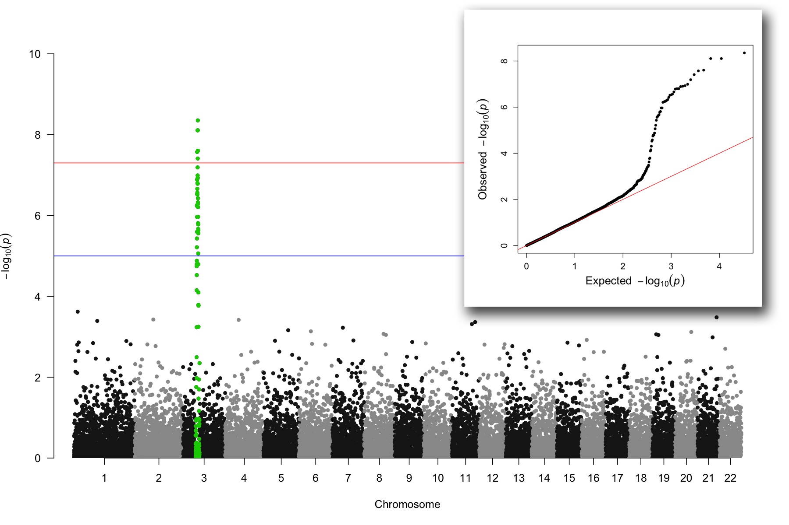

# Summary

Genome-wide association studies (GWAS) have been successful in identifying thousands of trait and disease-associated single nucleotide polymorphisms (SNPs). The primary result of a GWAS analysis is a list of SNPs, their associated chromosomal position, and a P-value representing the statistical significance of the association. A commonly used method used to visualize GWAS results is the "manhattan plot" -- a plot of the $-log_{10}(P)$ of the association statistic on the _y_-axis versus the chromosomal position of the SNP on the _x_-axis. Another commonly used results diagnostic plot is the quantile-quantile ("Q-Q") plot. Q-Q plots display the observed association _P_-value for all SNPs on the y-axis versus the expected uniform distribution of P-values under the null hypothesis of no association on the _x_-axis. 

One of the most commonly used software packages for manipulating and analyzing GWAS data is PLINK (@purcell2007plink). `qqman` is an R package that allows for quick and flexible generation of publication-ready Q-Q and manhattan plots directly from PLINK results files. The `qqman` package is a user-friendly tool to visualize results from GWAS experiments using Q-Q and manhattan plots. The `manhattan()` function in the `qqman` package takes a data frame with columns containing the chromosome number, chromosomal position, P-value, and optionally the SNP name. By default, `manhattan()` looks for column names corresponding to those output by the `plink --assoc` command, namely, "CHR," "BP," "P," and "SNP," although different column names can be specified by the user. Thresholds for suggestive and genome-wide significance are drawn, and users also have the ability to highlight/annotate SNPs of interest. Finally, the `qq()` function can be used to generate a Q-Q plot to visualize the distribution of association _P_-values. An example of the plots produced by `qqman` is shown in Figure 1.

These graphics can be created in other software, such as the standalone desktop software Haploview (@barrett2004haploview), or for focused regions using the web-based application LocusZoom (@pruim2010locuszoom). Conversely, `qqman` is distributed as an R package with no other dependencies that can be easily integrated into existing R-based scripted workflows to further enable automated reproducible research. Furthermore, users can take advantage of R's very granular control of graphical output, enabling a high degree of customizability in creating high-resolution, publication-ready figures. The `qqman` package ships with example data and a detailed vignette illustrating its usage and further features not described here. The package is available on GitHub under the GNU General Public License at <https://github.com/stephenturner/qqman> and on the Comprehensive R Archive Network (CRAN) at <https://cran.r-project.org/package=qqman>.

# References